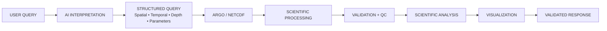
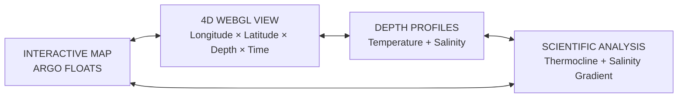

# FLOATCHAT

### Multi-Modal Semantic Query Engine & 4D Visualization Platform for ARGO Oceanographic Data

> **Explore the Ocean. Ask the Data.**

<p align="center">
  <strong>Natural Language • AI Agents • ARGO Data • Scientific Analysis • 4D WebGL</strong>
</p>

---

## Overview

**FLOATCHAT** is an intelligent oceanographic data exploration platform that provides a conversational and visual interface for exploring **ARGO ocean observations**.

The platform combines natural-language interaction, AI-agent orchestration, scientific data processing, oceanographic analysis, and interactive visualization into a single exploration environment.

Users can interact with oceanographic data through:

- Natural-language queries
- Interactive geographic maps
- ARGO float locations
- Float trajectories
- Temperature-depth profiles
- Salinity-depth profiles
- Time-based exploration
- Scientific analysis
- Interactive 4D WebGL visualization

Instead of manually constructing complex dataset queries, users can describe what they want to explore in natural language.

For example:

> **"Show ARGO floats near the Arabian Sea and visualize their temperature and salinity profiles."**

FLOATCHAT interprets the request, converts it into a structured scientific query, retrieves and processes the relevant data, performs validation and analysis, and presents the results through coordinated visualizations.

---

# Key Features

## Natural-Language Ocean Querying

FLOATCHAT allows users to describe oceanographic queries using natural language.

The Query Agent identifies:

- Geographic constraints
- Temporal constraints
- Depth constraints
- Oceanographic parameters
- Required scientific analysis
- Required visualization

Example:

```text
Show temperature profiles for ARGO floats
near the Arabian Sea between January and March 2024.
```

The request can be transformed into structured parameters such as:

```text
Location
Time Range
Depth Range
Temperature
Required Visualization
```

---

## Interactive ARGO Exploration

The interactive explorer provides a geographic view of ocean observations.

Users can explore:

- ARGO float locations
- Float trajectories
- Geographic regions
- Observation points
- Selected float information
- Time-dependent observations

---

## 4D Ocean Visualization

FLOATCHAT represents ocean observations using four dimensions:

| Dimension | Representation |
|-----------|----------------|
| **X** | Longitude |
| **Y** | Latitude |
| **Z** | Depth |
| **T** | Time |

The 4D WebGL environment provides an interactive representation of ARGO float trajectories and their evolution through space, depth, and time.

The visualization supports:

- ARGO float markers
- Trajectory trails
- Depth representation
- Time slider
- Play / Pause
- Playback speed
- Rotation
- Zoom
- Pan
- Float selection
- Interactive float information

---

## Temperature Analysis

FLOATCHAT provides temperature-depth profiles for exploring how temperature varies through the water column.

---

## Salinity Analysis

The platform provides salinity-depth profiles for examining vertical salinity variation.

---

## Thermocline Analysis

FLOATCHAT analyzes temperature variation with depth to identify thermocline-related regions within an observed profile.

---

## Salinity Gradient Analysis

The system analyzes changes in salinity with depth to identify regions of significant vertical salinity variation.

Conceptually:

```text
Salinity Gradient ≈ ΔSalinity / ΔDepth
```

---

## Scientific Validation

Before presenting analytical results, the system can evaluate:

- Data availability
- Spatial coverage
- Temporal coverage
- Depth coverage
- Parameter availability
- Profile sufficiency
- ARGO quality-control information

Measurements that fail the configured quality-control criteria can be excluded from scientific processing.

---

# Functional Architecture

The following diagram represents the primary functional flow of FLOATCHAT from user input to the final interactive explorer.

```mermaid
flowchart LR

    U["USER INPUT<br/>Natural Language • Map • Controls"]

    O["ORCHESTRATOR AGENT<br/>Task Planning & Coordination"]

    Q["QUERY AGENT<br/>Natural Language → Structured Query"]

    SQ["STRUCTURED OCEAN QUERY<br/>Location • Time • Depth • Parameters"]

    D["DATA AGENT<br/>Data Retrieval & Filtering"]

    ARGO["ARGO / NETCDF<br/>Oceanographic Data"]

    P["SCIENTIFIC PROCESSING<br/>xarray • NumPy • SciPy"]

    QC["VALIDATION & QC<br/>Coverage • Availability • Quality"]

    A["ANALYSIS AGENT<br/>Oceanographic Analysis"]

    T["TEMPERATURE<br/>Depth Profile"]

    S["SALINITY<br/>Depth Profile"]

    TH["THERMOCLINE<br/>Analysis"]

    SG["SALINITY GRADIENT<br/>Analysis"]

    V["VISUALIZATION AGENT"]

    MAP["INTERACTIVE MAP<br/>Float Locations & Trajectories"]

    FOURD["4D WEBGL<br/>Longitude × Latitude × Depth × Time"]

    PROFILE["DEPTH PROFILES<br/>Temperature + Salinity"]

    R["RESPONSE AGENT<br/>Validated Scientific Explanation"]

    OUT["FLOATCHAT EXPLORER<br/>Interactive Scientific Insights"]

    U --> O
    O --> Q
    Q --> SQ
    SQ --> D
    D --> ARGO
    ARGO --> P
    P --> QC

    QC --> A
    QC --> V

    A --> T
    A --> S

    T --> TH
    S --> SG

    A --> V
    A --> R

    V --> MAP
    V --> FOURD
    V --> PROFILE

    MAP --> OUT
    FOURD --> OUT
    PROFILE --> OUT
    R --> OUT

    MAP <--> FOURD
    FOURD <--> PROFILE
    PROFILE <--> A
```



---

# Functional Workflow

## 1. User Input

The user interacts with FLOATCHAT using:

- Natural-language queries
- Interactive map selections
- Time controls
- Depth controls
- Visualization controls

---

## 2. Orchestrator Agent

The Orchestrator Agent coordinates the complete workflow.

It determines:

- User intent
- Required operations
- Required agents
- Execution sequence
- Final response structure

---

## 3. Query Agent

The Query Agent converts natural-language requests into structured scientific queries.

For example:

```text
"Show salinity near this region during June."
```

can be interpreted as:

```text
Location  → Selected geographic region
Time      → June
Parameter → Salinity
Output    → Salinity profile / visualization
```

A structured query can contain:

```text
Location
Latitude
Longitude
Bounding Region
Time Range
Depth Range
Parameters
Analysis Type
```

---

## 4. Data Agent

The Data Agent handles oceanographic data retrieval and filtering.

Typical operations include:

- Spatial filtering
- Temporal filtering
- Depth filtering
- Parameter selection
- Profile extraction

---

## 5. Scientific Processing

Scientific processing is performed using deterministic scientific tools.

Typical technologies include:

- xarray
- NumPy
- SciPy
- pandas

This layer performs the actual dataset operations and numerical calculations.

---

## 6. Validation and Quality Control

The retrieved data passes through validation before analysis.

```text
Data Availability
       ↓
Spatial Coverage
       ↓
Temporal Coverage
       ↓
Depth Coverage
       ↓
Parameter Availability
       ↓
Quality-Control Checks
       ↓
Validated Dataset
```

---

## 7. Scientific Analysis

The Analysis Agent performs the requested oceanographic analysis.

Examples include:

- Temperature-depth analysis
- Salinity-depth analysis
- Thermocline analysis
- Salinity-gradient analysis
- Float trajectory analysis

---

## 8. Visualization

The Visualization Agent converts processed results into:

- Interactive maps
- Float trajectories
- 4D WebGL visualization
- Temperature-depth profiles
- Salinity-depth profiles

---

## 9. Response

The Response Agent generates a natural-language explanation based on the validated analytical results.

The response is grounded in the processed data and analysis rather than unsupported generated values.

---

# Multi-Agent Architecture

FLOATCHAT uses specialized agents for different stages of the workflow.

| Agent | Responsibility |
|-------|----------------|
| **Orchestrator Agent** | Task planning and coordination |
| **Query Agent** | Natural language → structured scientific query |
| **Data Agent** | ARGO / NetCDF retrieval and filtering |
| **Analysis Agent** | Oceanographic analysis |
| **Validation Agent** | Data availability and quality checks |
| **Visualization Agent** | Maps, profiles and 4D visualization |
| **Response Agent** | Natural-language scientific explanation |

### Agent Flow

```text
                         USER
                           │
                           ▼
                 ┌───────────────────┐
                 │   ORCHESTRATOR    │
                 │       AGENT       │
                 └─────────┬─────────┘
                           │
             ┌─────────────┴─────────────┐
             ▼                           ▼
      ┌──────────────┐           ┌──────────────┐
      │ QUERY AGENT  │           │  DATA AGENT  │
      └──────┬───────┘           └──────┬───────┘
             │                          │
             └──────────┬───────────────┘
                        ▼
              ┌───────────────────┐
              │ ARGO / NETCDF DATA│
              └─────────┬─────────┘
                        │
                        ▼
              ┌───────────────────┐
              │ SCIENTIFIC        │
              │ PROCESSING        │
              └─────────┬─────────┘
                        │
                        ▼
              ┌───────────────────┐
              │ VALIDATION & QC   │
              └─────────┬─────────┘
                        │
                        ▼
              ┌───────────────────┐
              │ ANALYSIS AGENT    │
              └─────────┬─────────┘
                        │
             ┌──────────┴──────────┐
             ▼                     ▼
      ┌──────────────┐      ┌──────────────┐
      │VISUALIZATION │      │   RESPONSE   │
      │    AGENT     │      │    AGENT     │
      └──────┬───────┘      └──────┬───────┘
             │                     │
             └──────────┬──────────┘
                        ▼
               FLOATCHAT EXPLORER
```

---

# Natural-Language Query Pipeline



---

# 4D Ocean Visualization

The FLOATCHAT 4D environment represents oceanographic observations using:

```text
X = Longitude
Y = Latitude
Z = Depth
T = Time
```

The fourth dimension is represented through time-dependent observation and trajectory changes.

### 4D Visualization Components

- ARGO float markers
- Trajectory trails
- Depth representation
- Time slider
- Play / Pause
- Playback speed
- Interactive camera
- Float selection
- Float information
- Time-dependent trajectory movement

### Conceptual Representation

```text
                    TIME
                      │
                      ▼
             ┌─────────────────┐
             │   4D OCEAN      │
             │   ENVIRONMENT   │
             └────────┬────────┘
                      │
          ┌───────────┼───────────┐
          ▼           ▼           ▼
      Longitude     Depth      Latitude
          │           │           │
          └───────────┼───────────┘
                      ▼
               ARGO TRAJECTORY
```

---

# Linked Visualization

FLOATCHAT connects its major scientific views.



Example interaction:

```text
Select ARGO Float
       ↓
Highlight Trajectory
       ↓
Update 4D View
       ↓
Update Depth Profiles
       ↓
Update Scientific Analysis
```

---

# Scientific Analysis

## Temperature-Depth Profile

Temperature can be represented as a function of depth.

```text
Temperature
     │
     │\
     │ \
     │  \
     │   \
     │    \
     └────────── Depth
```

The actual profile depends on the selected oceanographic observations.

---

## Salinity-Depth Profile

Salinity can be represented as a function of depth.

```text
Salinity
     │
     │ \
     │  \
     │   \
     │    \
     └────────── Depth
```

---

## Thermocline Analysis

The thermocline represents a region of significant temperature variation with depth.

FLOATCHAT analyzes temperature-depth observations to identify thermocline-related regions.

---

## Salinity Gradient Analysis

The platform analyzes the vertical variation of salinity.

Conceptually:

```text
Salinity Gradient ≈ ΔSalinity / ΔDepth
```

The resulting analysis can be displayed alongside the corresponding depth profile.

---

# ARGO / NetCDF Data Processing

FLOATCHAT is designed around scientific oceanographic data processing.

```text
ARGO / NetCDF
      ↓
Dataset Loading
      ↓
Spatial Filtering
      ↓
Temporal Filtering
      ↓
Depth Filtering
      ↓
Parameter Selection
      ↓
Quality Control
      ↓
Scientific Analysis
      ↓
Visualization
```

Relevant variables may include:

```text
Latitude
Longitude
Time
Pressure / Depth
Temperature
Salinity
Quality-Control Information
```

---

# Technology Stack

## Frontend

| Technology | Purpose |
|------------|---------|
| **Next.js** | Web application framework |
| **React** | User interface |
| **TypeScript** | Application development |
| **Tailwind CSS** | Interface styling |
| **Three.js** | 3D / WebGL rendering |
| **React Three Fiber** | React-based 3D visualization |
| **React Three Drei** | 3D visualization utilities |
| **Plotly.js** | Scientific charts and depth profiles |

## Data & Processing

| Technology | Purpose |
|------------|---------|
| **TypeScript Data Layer** | ARGO-style data representation and filtering |
| **Demo ARGO Data Generator** | Generates prototype oceanographic observations |
| **Custom Query Parser** | Converts natural-language input into structured filters |
| **Custom Scientific Analysis** | Temperature, salinity, thermocline and gradient calculations |
| **Quality Control Module** | Filters observations using configured QC criteria |

## Visualization

| Technology | Purpose |
|------------|---------|
| **Three.js** | 3D/WebGL rendering |
| **React Three Fiber** | Interactive 3D trajectory visualization |
| **Plotly.js** | Temperature and salinity depth profiles |
| **Interactive Map Component** | Geographic ARGO float exploration |

---

# Data & Prototype Status

The current prototype may use **synthetic/demo ARGO-style data** for development and demonstration.

Demo data is used for:

- Query processing
- Map visualization
- Float trajectories
- 4D rendering
- Depth-profile visualization
- Scientific analysis demonstrations
- Agent workflow testing

Synthetic/demo observations should not be interpreted as actual measured ocean observations.

The architecture is designed to support integration with real ARGO / NetCDF datasets.

---

# Current Implementation

The current prototype demonstrates:

- Natural-language query interface
- Interactive ocean explorer
- ARGO float locations
- Float trajectories
- Temperature visualization
- Salinity visualization
- Temperature-depth profiles
- Salinity-depth profiles
- Thermocline analysis
- Salinity-gradient analysis
- Interactive 3D / 4D visualization
- Time controls
- Scientific validation interface
- AI-generated explanations
- Oceanographic dashboard

---

# Future Development

## Real ARGO Integration

Direct integration with operational ARGO data services and larger NetCDF collections.

## Advanced 4D Visualization

Potential extensions include:

- Multi-float synchronization
- Temporal interpolation
- Dynamic trajectory playback
- Advanced depth exploration
- Improved time-dependent visualization

## Advanced Oceanographic Analysis

Potential extensions include:

- Mixed-layer depth
- Water-mass identification
- Ocean fronts
- Temperature anomalies
- Salinity anomalies
- Vertical stratification
- Spatio-temporal comparisons

## Large-Scale Data Processing

Potential extensions include:

- Dataset caching
- Chunked processing
- Parallel computation
- Spatial indexing
- Optimized NetCDF access

## Advanced Visualization

Potential extensions include:

- 3D ocean fields
- Isotherms
- Isopycnals
- Ocean sections
- Anomaly visualization
- Multi-float comparison

---

# Technical Focus

FLOATCHAT integrates:

```text
Natural Language Processing
          +
AI Agent Orchestration
          +
ARGO Oceanographic Data
          +
NetCDF Processing
          +
Scientific Computing
          +
Geospatial Analytics
          +
4D WebGL Visualization
          +
Scientific Data Validation
```

The platform is designed to provide an interactive scientific interface while keeping data processing and numerical analysis within deterministic computational components.
